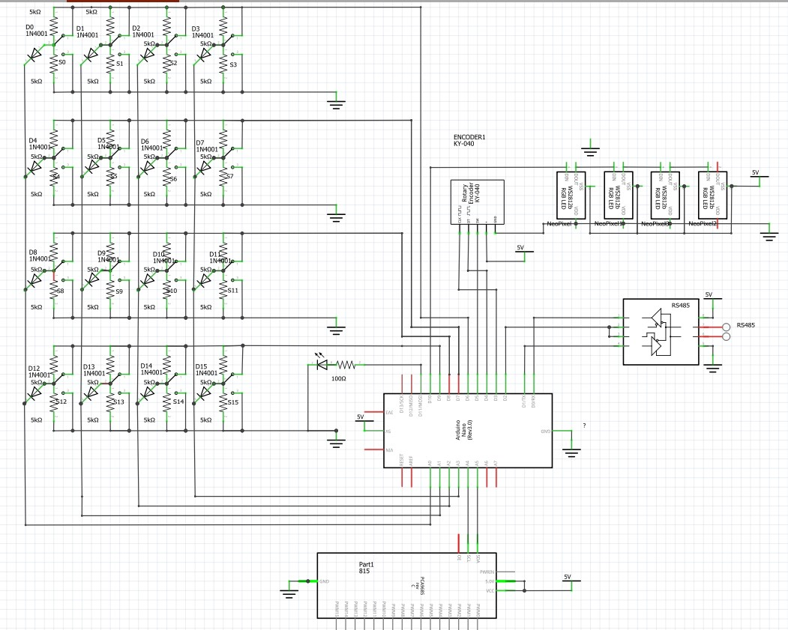

# H1Model Railway Layout Control 
# H3 Steve Lomax 2021 not for commercial use. 
Adafruit acknowledgement below

please acknowledge author if redistributing or modifying

Arduino Nano or similar
RS485 module 
- DI-> pinTXO
- DE+RE-> pin 2
- RO-> pin RX1

- Up to 16 (13 used) servos to PWM module  board
- Rotary enc for point calibration on pins 3 & 4 with switch on pin 5
- i2c on A4 & A5 for 16 servo  PCA9685  module
- 36 (32 used) addressable LEDs for mimic (prototype utilises fibre optic light-pipe for panel "indicator lamps")

This Project works alongsside the sensor detectors  and the turntable sketches

FEATURES:
optional communication with JMRI over RS485 and C/MRI Switch Panel will work without a PC
- JMRI should be set up so that sensors returned from this sketch via C/MRI action actual point switching
- CMRI must read the point position JMRI wants to switch. The sketch will elther use that data to control 
- the point if the switch is in the 'opposit thrown' position or use the switch Closed or Thrown position
- JMRI switches used the feedback to determine the actual switch position
  
Multiple Points may be paired or gruped together and operated by one switch
- point pairs are set in the sketch code
- The slave points in a Pair or Group may be individually inverted
- Pairing can be engaged or disengaged on the fly by pressing the encoder 4 times in under 1.5 seconds.
  
Point throw positions can be individually calibrated on the fly and changes may be undone or saved
- Long press to enter calibration (>3 seconds)
- short press to exit and undo changes
- long press to exit and save changes
- 
Point movement speed can be set at startup and saved
- long press on startup
- Rotate to change speed (switch a point and observe)
- long press to exit and save
- short press to exit and undo

Settings are made using a rotating encoder with a push switch

Calibration / settings LED

Point Movement LED

RGB LEDs indicating 
- point positions, Red route is un-set, Green route is set
- route colours update when under JMRI control and alternatley flash
- Auto control  Routes flash alternatively to indicate JMRI controls this point
- Point pairing Routes are shown as cyan and amber instead or red and green
- Point calibration. Purple for the point position under calibration
- Point moving is shown as flashing alternate blue and target for that route  whilst the point is moving
- colours can be changed in software
- 2mm light pipes to direct light from the LEDs on the WS2812B LED strip mounted on the back of the panel throuh holes on the front of the switch panel

6 wires between control and layout 
- SDA & SCL (I2C)
- A & B (RS485)
- 5V and GND (power) 
  
Switches are wired in a 4x4 matrix  
- 16 x double throw centre off (on-off-on)switches.
- 4 Digital pins switch each row high in turn
- 4 analog pins read the voltage of the switches in that row, one at a time.
- If the voltage is 0v to 1 volt (ground) the switch is thrown, 
- 1.5v to 3 v the switch is closed (centre off) and 
- 3.5 v the switch is in Auto mode and the KMRI setting is used
- 2 x 10K resistors to form voltage divider for each switch
- 1 diode on output to prevent voltage feedback between switches

  
   
   Parts
  - Arduino uno, nano etc &  breakout board
  - USB TO  RS-485 module
  - RS-485 to UART module
  - PCA9685  PWM (servo driver) module
  - up to 16 x DPSTCO OR *DPDTCO toggle switches thre prototype uses the other half to LED indicate control was switched to JMRI.
  - up to 16 x servos
  - 2 x 2k resistor
  - 32 x 10K resistor
  - 4 x 100K resistor
 -  2 x 200R resistor
 -  16 x 1N2007 diode or similar
 -   5V DC 1A PSU for electronics
  - 5V DC 2A PSU for servos & WS2812B LEDs (preferred to common PSU)
  - servo mounting hardware
  - servo knob (almost essential)
  - switch panel for mounting hardware
  - module mounting hardware
 -  rotary encoder module
 -  2 different colour LEDs
  - connecting wire
  - reset button
  -  power jack socket
  -  led strip WS2812B 2 LEDs per point
  -  2 metres 2mm fibre optic light pipe for led to mimic
 * *optional

    Arduino PIN connections
   
    0 (TX) => RS-485 DI
   
    1 (RX) => RS-485 RO
   
    2 => RS-485 DE&RE (linked)
   
    3 => Encoder DT
   
    4 => Encoder CLK (reverse 3&4 if operation is backward)

    5 => Encoder push switch (to GND)
   
    6 => switch matrix row 0 (sw0-3 point closed)
   
    7 => switch matrix row 1 (sw4-7 point closed)
   
    8 => switch matrix row 2 (sw8-11 point closed)
   
    9 => switch matrix row 3 (sw12-15 point closed)
   
    10 => PCA9685 OE(ENABLE)
   
    11 => WS2812B LED strip Data in
   
    12 => LED (PCA9685 ACTIVE - POINTS MOVING) via 200R resistor
   
    13 => LED (CALIBRATING - ENCODER ACTIVE) via 200R resistor
   
    A0 => switch matrix COL 0 (sw 0,4,8,12)
   
    A1 => switch matrix COL 1 (sw 1,5,9,13)
   
    A2 => switch matrix COL 2 (sw 2,6,10,14)
   
    A3 => switch matrix COL 3 (sw 3,7,11,15)
   
    A4 => PCA9685 SDA + 2K pullup resistor
   
    A5 => PCA9685 SCL + 2K pullup resistor
   
    A6 => NOT USED
   
    A7 => NOT USED
   
    RST => RESET PUSH SWITCH TO GROUND
   
    GND => COMMON GROUND ALL SUPPLIES ALL MODULES
   
    VCC => 5V REG INPUT, to encoder VCC, PCA9685 VCC

    RAW/IN =>ALTERNATIVE 6-12V INPUT
   
    A suitable 5V servo supply is required.

    the sketch and hardware counts switches, channels and servos starting at 0
    (e.g. 16 switches numbered 0 to 15) the 1st channel is channel 0

   CALIBRATING POINT POSITIONS
   to enter calibration, press and hold down the encoder button for around 3 seconds until the calibration LED lights steady.
   
   The LED will briefly flash to signify the initial press and then stay lit if calibration mode is successful.
   
   The last switch moved (which may be changed by JMRI) will be the point currently being calibrated
   
   Moving the encoder will change the current point position of the last switch moved for that switch position (thrown or closed)
   
   Changing a switch (manually or by JMRI) will make that point the current point under calibration.
   
   Previously recalibrated point positions will be temporarily stored for the remainder of the calibration mode.
   
   It is possible to set a closed point position to a thrown switch position and vice-versa.
   (useful if the mainline is on a thrown point)

   One, many or all points may be calibrated and adjusted any number of times in one calibrating session.

   There are 2 ways to exit from calibration mode:

    1) a long encoder press will store all new positions to internal memory and exit calibration all previous positions will be permanently overwritten

    2) a short press will keep the new positions only until the device is reset or restarted. The previously stored positions will then be loaded and the new positions deleted
   point moving speed is maximum when calibrating.

  Fastled led :  A WS2812B 32 LED strip Data connected to pin 11 for mimic pointy positions:
  

